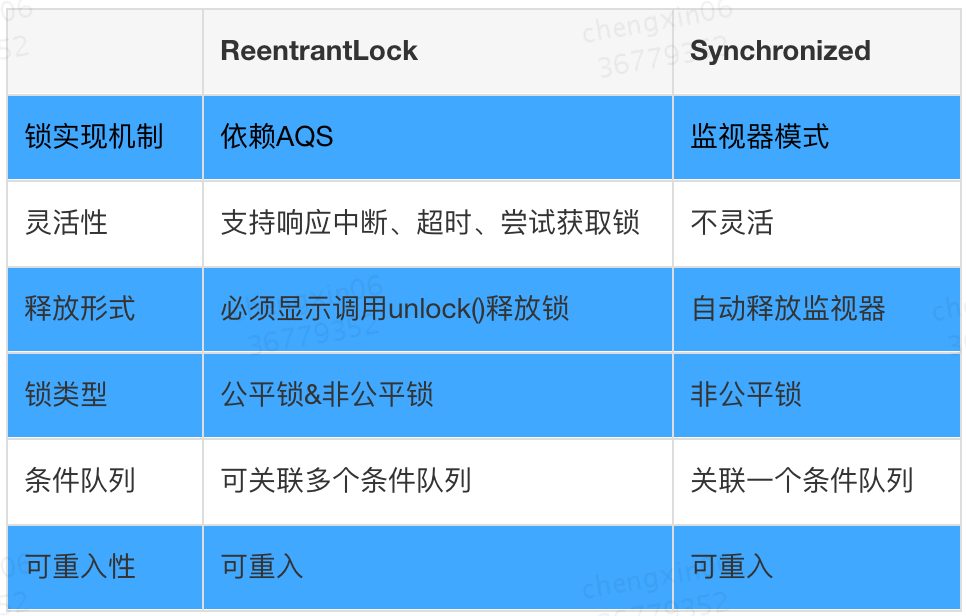

# JUC knowledge points 多线程与高并发知识点 ReentrantLock AQS JMM Synchronized 线程池

# JMM（Java内存模型Java Memory Model）
本身是一种抽象的概念并不真实存在，它仅仅描述的是一组约定或规范，通过这组规范定义了程序中（尤其是多线程）各个变量的读写访问方式并决定一个线程对共享变量的写入以及如何变成对另一个线程可见，关键技术点都是围绕多线程的原子性、可见性和有序性展开的。

**1.通过JMM来实现线程和主内存之间的抽象关系**

**2.屏蔽各个硬件平台和操作系统的内存访问差异以实现让Java程序再各种平台下都能达到一致性的内存访问效果。**

系统中主内存共享变量数据修改被写入的时机是不确定的，多线程并发下很可能出现“脏读”，所以每个线程都有自己的工作内存，线程自己的工作内存中保存了该线程使用到的变量的主内存副本拷贝，线程对变量的所有操作（读取、赋值等）都必须在线程自己的工作内存中进行，而不能够直接写入主内存中的变量，不同线程之间也无法直接访问对方工作内存中的变量，线程间变量值的传递均需要通过主内存来完成。

**原子性：指一个操作是不可被打断的，即多线程环境下，操作不能被其他线程干扰**

**有序性：对于一个线程的执行代码而言，我们总是习惯性地认为代码的执行总是从上到下，有序执行。但为了提升性能，编译器和处理器通常会对指令序列进行重新排序。**

小总结：
我们定义的所有共享变量都储存在物理主内存中
每个线程都有自己独立的工作内存，里面保证该线程使用到的共享变量的副本（主内存中该变量的一份拷贝）
线程对共享变量所有的操作都必须先在线程自己的工作内存中进行后写回主内存，不能直接从主内存在读写（不能越级）
不同线程之间也无法直接访问其他线程的工作内存中的变量，线程间变量值的传递需要通过主内存来进行（同级不能互相访问）。

**JMM规范下多线程先行发生原则之happens-before**

总原则:
如果一个操作happens-before另一个操作，那么第一个操作的执行结果将对第二个操作可见，而且第一个操作的执行顺序排在第二个操作之前
如果两个操作之间存在happens-before关系，并不意味着一定要按照happens-before原则制定的顺序来执行。如果重排之后的执行结果与按照happens-before关系来执行的结果一致，那么这种重排序并不非法。

1.次序规则：一个线程内，按照代码的顺序，写在前面的操作先行发生于写在后面的操作，也就是说前一个操作的结果可以被后续的操作获取（保证语义串行性，按照代码顺序执行）。

2.锁定规则：一个unLock操作先行发生于后面对同一个锁的lock操作（后面指时间上的先后）。

3.volatile变量规则：对一个volatile变量的写操作先行发生于后面对这个变量的读操作，前面的写对后面的读是可见的，这里的后面同样指时间上的先后

4.传递规则：如果操作A先行发生于操作B，而操作B又先行发生于操作C，则可以得出操作A先行发生于操作C。

5.线程启动规则（Thread start Rule）：Thread对象的start()方法先行发生于此线程的每一个动作

6.线程中断规则（Thread Interruption Rule）:  对线程interrupt()方法的调用先行发生于被中断线程的代码检测到中断事件的发生

7.线程终止规则（Thread Termination Rule）：线程中的所有操作都优先发生于对此线程的终止检测，我们可以通过isAlive()等手段检测线程是否已经终止执行。

8.对象终结规则（Finalizer Rule）：一个对象的初始化完成（构造函数执行结束）先行发生于它的finalize(）方法的开始------->对象没有完成初始化之前，是不能调用finalized()方法的

# volatile （内存屏障Memory Barrier）

两大特性： 

可见性：写完后立即刷新回主内存并及时发出通知，大家可以去主内存拿最新版，前面的修改对后面所有线程可见

有序性（禁重排）：    重排序是指编译器和处理器为了优化程序性能而对指令序列进行重新排序的一种手段，有时候会改变程序语句的先后顺序，若不存在数据依赖关系，可以重排序；存在数据依赖关系，禁止重排序；但重排后的指令绝对不能改变原有的串行语义！这点在并发设计中必须要重点考虑！

内存屏障其实就是一种JVM指令，Java内存模型的重排规则会要求Java编译器在生成JVM指令时插入特定的内存屏障指令，通过这些内存屏障指令，volatile实现了Java内存模型中的可见性和有序性（禁重排），但**volatile无法保证原子性**

内存屏障之前的所有写操作都要回写到主内存； 内存屏障之后的所有读操作都能获得内存屏障之前的所有写操作的最新结果（实现了可见性）

**因此重排序时，不允许把内存屏障之后的指令重排序到内存屏障之前。一句话：对一个volatile变量的写，先行发生于任意后续对这个volatile变量的读，也叫写后读。**

○ 对于编译器的重排序，JMM会根据重排序的规则，禁止特定类型的编译器重排序

○ 对于处理器的重排序，Java编译器在生成指令序列的适当位置，插入内存屏障指令，来禁止特定类型的处理器排序。

读屏障：在每个volatile读操作的后面插入一个LoadLoad屏障或者LoadStore屏障

写屏障：在每个volatile写操作的前面插入StoreStore屏障；在每个volatile写操作的后面插入StoreLoad屏障；

**volatile变量的符合操作不具有原子性，写丢失问题**

● volatile写之前的操作，都禁止重排序到volatile之后

● volatile读之后的操作，都禁止重排序到volatile之前

● volatile写之后volatile读，禁止重排序

# LongAdder

LongAdder的基本思路就是分散热点，将value值分散到一个Cell数组中，不同线程会命中到数组的不同槽中，各个线程只对自己槽中的那个值进行CAS操作，这样热点就被分散了，冲突的概率就小很多，如果要获取真正的long值，只要将各个槽中的变量值累加返回

sum()会将所有的Cell数组中的value和base累加作为返回值，核心的思想就是将之前AtomicLong一个value的更新压力分散到多个value中去，从而降级更新热点。

AtomicLong线程安全，可允许一些性能损耗，要求高精度时可使用，保证精度，多个线程对单个热点值value进行了原子操作-----保证精度，性能代码
LongAdder当需要在高并发场景下有较好的性能表现，且对值得精确度要求不高时，可以使用，LongAdder时每个线程拥有自己得槽，各个线程一般只对自己槽中得那个值进行CAS操作---保证性能，精度代价

# ThreadLocal

○ ThreadLocalMap实际上就是一个以ThreadLocal实例为Key，任意对象为value的Entry对象

○ 当我们为ThreadLocal变量赋值，实际上就是以当前ThreadLocal实例为Key，值为value的Entry往这个ThreadLocalMap中存放

JVM内部维护了一个线程版的Map<ThreadLocal, Value>（通过ThreadLocal对象的set方法，结果把ThreadLocal对象自己当作Key，放进了ThreadLocalMap中），每个线程要用到这个T的时候，用当前的线程去Map里面获取，通过这样让每个线程都拥有了自己独立的变量，人手一份，竞争条件被彻底消除，在并发模式下是绝对安全的变量。

弱引用：
比软引用的生命周期更短，对于只有弱引用的对象而言，只要垃圾回收机制一运行，不管JVM的内存空间是否足够，都会回收该对象占用的内存。

1.ThreadLocal一定要初始化，避免空指针异常。

2.建议把ThreadLocal修饰为static

3.用完记得手动remove

# Synchronized

**○ 偏向锁：MarkWord存储的是偏向的线程ID**

偏向锁：单线程竞争，当线程A第一次竞争到锁时，通过修改MarkWord中的偏向线程ID、偏向模式。如果不存在其他线程竞争，那么持有偏向锁的线程将永远不需要进行同步。

当有另外一个线程逐步来竞争锁的时候，就不能再使用偏向锁了，要升级为轻量级锁，使用的是等到竞争出现才释放锁的机制

**○ 轻量锁：MarkWord存储的是指向线程栈中Lock Record的指针**

有线程来参与锁的竞争，但是获取锁的冲突时间极短---------->本质是自旋锁CAS

自旋一定程度和次数（Java8 之后是自适应自旋锁------意味着自旋的次数不是固定不变的）：

● 线程如果自旋成功了，那下次自旋的最大次数会增加，因为JVM认为既然上次成功了，那么这一次也大概率会成功
● 如果很少会自选成功，那么下次会减少自旋的次数甚至不自旋，避免CPU空转

**○ 重量锁：MarkWord存储的是指向堆中的monitor对象（系统互斥量指针）**

1、当一个对象已经计算过identity hashcode，它就无法进入偏向锁状态，跳过偏向锁，直接升级轻量级锁；
2、偏向锁过程中遇到一致性哈希计算请求立马撤销偏向模式，膨胀为重量级锁。

# AQS
**参考美团技术团队博客：https://tech.meituan.com/2019/12/05/aqs-theory-and-apply.html**

若通过CAS设置变量State（同步状态）成功，也就是获取锁成功，则将当前线程设置为独占线程。

若通过CAS设置变量State（同步状态）失败，也就是获取锁失败，则进入Acquire方法进行后续处理。

公平锁和非公平锁的lock()方法唯一的区别就在于公平锁在获取同步状态时多了一个限制条件：hasQueuedPredecessors()-----公平锁加锁时判断等待队列中是否存在有效节点的方法

● 公平锁：公平锁讲究先来后到，线程在获取锁时，如果这个锁的等待队列中已经有线程在等待，那么当前线程就会进入到等待队列中；

● 非公平锁：不管是否有等待队列，如果可以获取到锁，则立刻占有锁对象。也就是说队列的第一个排队线程苏醒后，不一定就是排头的这个线程获得锁，它还需要参加竞争锁（存在线程竞争的情况下），后来的线程可能不讲武德插队夺锁了。

# AQS框架

图中有颜色的为Method，无颜色的为Attribution。

总的来说，AQS框架共分为五层，自上而下由浅入深，从AQS对外暴露的API到底层基础数据。

当有自定义同步器接入时，只需重写第一层所需要的部分方法即可，不需要关注底层具体的实现流程。当自定义同步器进行加锁或者解锁操作时，先经过第一层的API进入AQS内部方法，然后经过第二层进行锁的获取，接着对于获取锁失败的流程，进入第三层和第四层的等待队列处理，而这些处理方式均依赖于第五层的基础数据提供层。

AQS核心思想是，如果被请求的共享资源空闲，那么就将当前请求资源的线程设置为有效的工作线程，将共享资源设置为锁定状态；如果共享资源被占用，就需要一定的阻塞等待唤醒机制来保证锁分配。这个机制主要用的是CLH队列的变体实现的，将暂时获取不到锁的线程加入到队列中。

**同步状态State**

非公平锁与AQS之间方法的关联之处

通过ReentrantLock的加锁方法Lock进行加锁操作。 会调用到内部类Sync的Lock方法，由于Sync#lock是抽象方法，根据ReentrantLock初始化选择的公平锁和非公平锁，执行相关内部类的Lock方法，本质上都会执行AQS的Acquire方法。 AQS的Acquire方法会执行tryAcquire方法，但是由于tryAcquire需要自定义同步器实现，因此执行了ReentrantLock中的tryAcquire方法，由于ReentrantLock是通过公平锁和非公平锁内部类实现的tryAcquire方法，因此会根据锁类型不同，执行不同的tryAcquire。 tryAcquire是获取锁逻辑，获取失败后，会执行框架AQS的后续逻辑，跟ReentrantLock自定义同步器无关。

Acquire方法：如果tryAcquire方法返回了True，则说明当前线程获取锁成功，就不用往后执行了；如果获取失败，就调用addWaiter加入到等待队列中。

请注意，初始化的头结点并不是当前线程节点，而是调用了无参构造函数的节点。如果经历了初始化或者并发导致队列中有元素，则与之前的方法相同。其实，addWaiter就是一个在双端链表添加尾节点的操作，需要注意的是，双端链表的头结点是一个无参构造函数的头结点。

**addWaiter方法**，这个方法其实就是把对应的线程以Node的数据结构形式加入到双端队列里，返回的是一个包含该线程的Node。而这个Node会作为参数，进入到acquireQueued方法中。acquireQueued方法可以对排队中的线程进行“获锁”操作。

跳出当前循环的条件是当“前置节点是头结点，且当前线程获取锁成功”。为了防止因死循环导致CPU资源被浪费，我们会判断前置节点的状态来决定是否要将当前线程挂起，具体挂起流程用流程图表示如下（shouldParkAfterFailedAcquire流程）：

